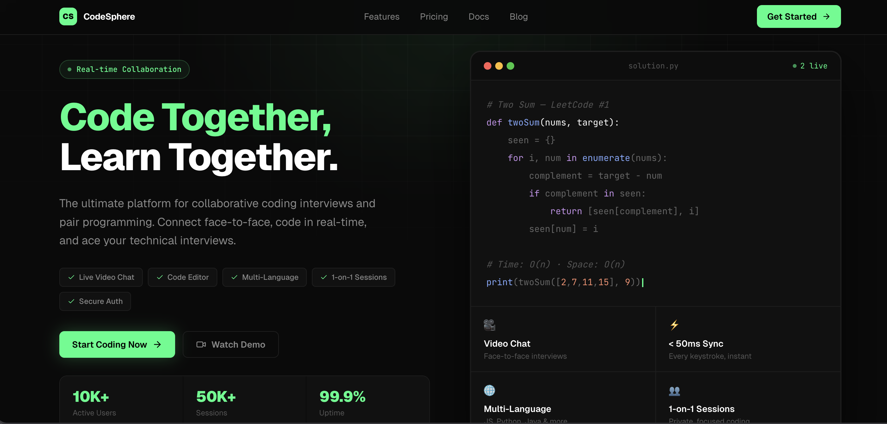
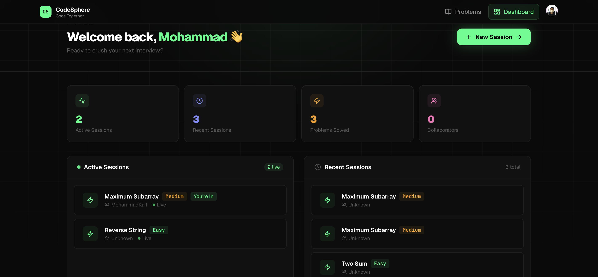
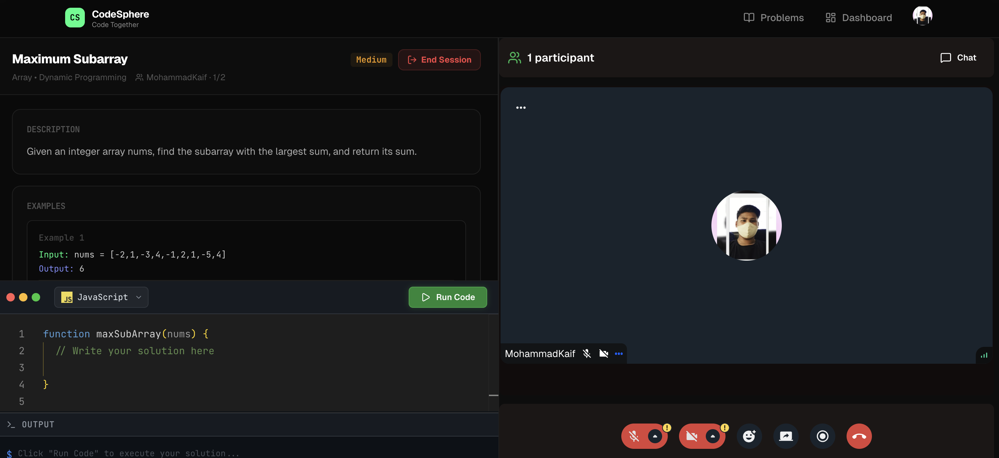

# CodeSphere — Code Together

> A real-time collaborative coding platform for technical interviews and pair programming.

---

## 🚀 Live Demo

**[https://code-sphere-beta.vercel.app/](https://code-sphere-beta.vercel.app/)**

> Try it out — create a session, pick a problem, and start coding with a friend in real-time.

---

## What is CodeSphere?

CodeSphere lets two developers share a live code editor, video call, and chat — all in one browser tab. Whether you're running a technical interview or doing pair programming, everything syncs in real-time with under 50ms latency.

---

## Features

- **Live Code Editor** — Monaco-powered editor with real-time collaboration, syntax highlighting, and support for 60+ languages
- **HD Video Calls** — Face-to-face interviews powered by Stream Video SDK
- **Session Chat** — In-session messaging via Stream Chat
- **Code Execution** — Run code instantly in sandboxed containers via the Piston API
- **Problem Library** — Curated coding problems (Easy / Medium / Hard) with examples and constraints
- **Session Management** — Create, join, and track coding sessions with full history
- **Auth** — Secure authentication via Clerk (Google + GitHub OAuth)

---
---
 
## Preview
 

 
### Dashboard

 
### Live Session

 
---
 
## Tech Stack

### Frontend
| Technology | Purpose |
|---|---|
| React 19 | UI framework |
| Vite | Build tool & dev server |
| Tailwind CSS | Styling (no DaisyUI) |
| React Router v7 | Client-side routing |
| TanStack Query | Server state & caching |
| Monaco Editor | Code editor |
| Stream Video SDK | Video calls |
| Stream Chat SDK | In-session messaging |
| Clerk | Authentication |
| Lucide React | Icons |
| React Hot Toast | Notifications |
| Canvas Confetti | Celebration animations |

### Backend
| Technology | Purpose |
|---|---|
| Node.js + Express | REST API server |
| MongoDB + Mongoose | Database |
| Clerk SDK | Auth verification |
| Stream SDK | Video/Chat token generation |
| Inngest | Background jobs & event-driven workflows |

### External APIs
| Service | Purpose |
|---|---|
| [Piston API](https://github.com/engineer-man/piston) | Code execution (60+ languages) |
| [Clerk](https://clerk.com) | Authentication & user management |
| [Stream](https://getstream.io) | Video calls & real-time chat |
| [Inngest](https://inngest.com) | Background jobs & durable workflows |

---

## Project Structure

```
CodeSphere/
├── client/                   # React frontend
│   ├── public/
│   │   └── favicon.svg
│   ├── src/
│   │   ├── components/
│   │   │   ├── ActiveSessions.jsx
│   │   │   ├── CodeEditorPanel.jsx
│   │   │   ├── CreateSessionModal.jsx
│   │   │   ├── Navbar.jsx
│   │   │   ├── OutputPanel.jsx
│   │   │   ├── ProblemDescription.jsx
│   │   │   ├── RecentSessions.jsx
│   │   │   ├── StatsCards.jsx
│   │   │   ├── VideoCallUI.jsx
│   │   │   └── WelcomeSection.jsx
│   │   ├── data/
│   │   │   └── problem.js        # Problem library + language configs
│   │   ├── hooks/
│   │   │   ├── useSessions.js    # TanStack Query hooks
│   │   │   └── useStreamClient.js
│   │   ├── lib/
│   │   │   ├── piston.js         # Code execution API
│   │   │   └── utils.js
│   │   ├── pages/
│   │   │   ├── HomePage.jsx
│   │   │   ├── FeaturesPage.jsx
│   │   │   ├── PricingPage.jsx
│   │   │   ├── DocsPage.jsx
│   │   │   ├── BlogPage.jsx
│   │   │   ├── DashboardPage.jsx
│   │   │   ├── ProblemsPage.jsx
│   │   │   ├── ProblemPage.jsx
│   │   │   └── SessionPage.jsx
│   │   ├── App.jsx
│   │   ├── App.css
│   │   └── main.jsx
│   ├── index.html
│   ├── package.json
│   └── vite.config.js
│
└── server/                   # Express backend
    ├── src/
    │   ├── controllers/
    │   │   ├── chatController.js
    │   │   └── sessionController.js
    │   ├── lib/
    │   │   ├── db.js             # MongoDB connection
    │   │   ├── env.js            # Environment variable validation
    │   │   ├── inngest.js        # Inngest client & functions
    │   │   └── stream.js         # Stream SDK setup
    │   ├── middleware/
    │   │   └── protectRoute.js   # Clerk auth guard
    │   ├── models/
    │   │   ├── Session.js
    │   │   └── User.js
    │   ├── routes/
    │   │   ├── chatRoutes.js
    │   │   └── sessionRoute.js
    │   └── server.js
    ├── .env
    └── package.json
```

---

## Getting Started

### Prerequisites

- Node.js 18+
- MongoDB (local or Atlas)
- Clerk account → [clerk.com](https://clerk.com)
- Stream account → [getstream.io](https://getstream.io)

### 1. Clone the repo

```bash
git clone https://github.com/your-username/codesphere.git
cd codesphere
```

### 2. Set up the server

```bash
cd server
npm install
```

Create `server/.env`:

```env
PORT=5000
MONGODB_URI=your_mongodb_connection_string

# Clerk
CLERK_SECRET_KEY=sk_test_...

# Stream
STREAM_API_KEY=your_stream_api_key
STREAM_API_SECRET=your_stream_api_secret
```

Start the server:

```bash
npm run dev
```

### 3. Set up the client

```bash
cd client
npm install
```

Create `client/.env`:

```env
VITE_CLERK_PUBLISHABLE_KEY=pk_test_...
VITE_STREAM_API_KEY=your_stream_api_key
VITE_API_BASE_URL=http://localhost:5000
```

Start the client:

```bash
npm run dev
```

The app will be running at `http://localhost:5173`.

---

## Environment Variables

### Server (`server/.env`)

| Variable | Description |
|---|---|
| `PORT` | Server port (default: 5000) |
| `MONGODB_URI` | MongoDB connection string |
| `CLERK_SECRET_KEY` | Clerk secret key from dashboard |
| `STREAM_API_KEY` | Stream API key |
| `STREAM_API_SECRET` | Stream API secret |

### Client (`client/.env`)

| Variable | Description |
|---|---|
| `VITE_CLERK_PUBLISHABLE_KEY` | Clerk publishable key |
| `VITE_STREAM_API_KEY` | Stream API key (public) |
| `VITE_API_BASE_URL` | Backend API URL |

---

## Pages & Routes

| Route | Access | Description |
|---|---|---|
| `/` | Public | Landing page (redirects to dashboard if signed in) |
| `/features` | Public | Feature overview |
| `/pricing` | Public | Pricing plans |
| `/docs` | Public | Documentation |
| `/blog` | Public | Blog & guides |
| `/dashboard` | Auth required | Session overview & stats |
| `/problems` | Auth required | Problem library |
| `/problem/:id` | Auth required | Solo problem solving |
| `/session/:id` | Auth required | Live collaborative session |

---

## How a Session Works

```
1. Host creates a session → selects a problem & difficulty
2. Server creates a MongoDB document + Stream video/chat channel
3. Host shares the session link with a participant
4. Participant joins → auto-joined via useEffect on SessionPage
5. Both users see the same Monaco editor, video call, and chat
6. Host can end the session → status set to "completed"
7. All participants are redirected to dashboard
```

---

## Scripts

### Client
```bash
npm run dev       # Start dev server (Vite)
npm run build     # Production build
npm run preview   # Preview production build
```

### Server
```bash
npm run dev       # Start with nodemon
npm start         # Production start
```

---


1. Clone the repository
2. Create a feature branch — `git checkout -b feature/your-feature`
3. Commit your changes — `git commit -m "feat: add your feature"`
4. Push to the branch — `git push origin feature/your-feature`
5. Open a Pull Request

---


<div align="center">
  <strong>Built with ☕ and too many coding sessions</strong><br/>
  <a href="https://code-sphere-beta.vercel.app/">Live Demo</a> · <a href="/features">Features</a> · <a href="/pricing">Pricing</a> · <a href="/docs">Docs</a> · <a href="/blog">Blog</a>
</div>
